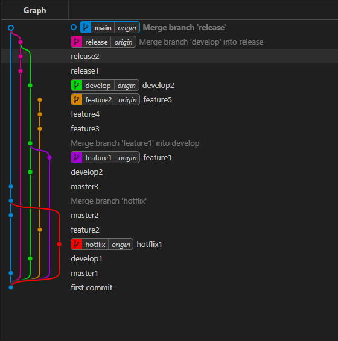

# Explicación de Ramas y Conflictos.

## Ramas
    Para la creación de ramas he creado las 6 ramas con sus respectivos nombres.
    En el main he hecho 5 commit
    En release he hecho 3 commit
    En develop he hecho 4 commit
    En feature2 he hecho 4 commit
    En feature1 he hecho 1 commit
    En hotflix he hecho 1 commit

## Conflictos
    Los conflictos que he creado han sido:
    - Un merge entre hotflix y main
    - Un merge entre feature1 y develop
    - Un merge entre develop y release
    - Un merge entre release y main

